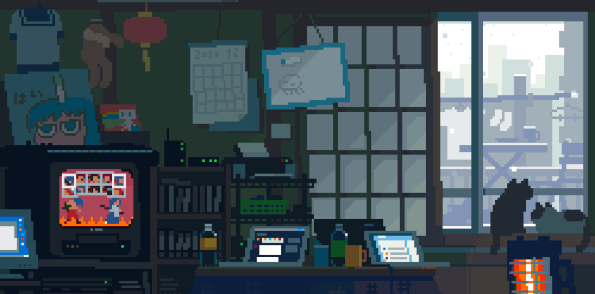

  <!-- Writing Animation for Name using Readme Typing SVG -->
  

  <!-- Aesthetic Coding GIF (ensure `assets/Meow.gif` exists in your repo) -->
  

  💻 <strong>Software Engineer</strong> | Flutter Developer | MERN Developer | AI Enthusiast 
  🎮 Building interactive Websites & Mobile Applications 

  <!-- Social & Workflow Badges -->
  
  
  
  </a>

---

## 📊 GitHub Stats & Top Languages

  
  

---

## 🚀 Tech Stack & Languages

  &nbsp;
  &nbsp;
  &nbsp;
  &nbsp;
  &nbsp;
  &nbsp;
  &nbsp;
  &nbsp;
  &nbsp;
  &nbsp;
  &nbsp;
  &nbsp;
  &nbsp;
  &nbsp;
  &nbsp;
  &nbsp;
  &nbsp;
  &nbsp;
  &nbsp;
  &nbsp;
  &nbsp;
  &nbsp;
  &nbsp;

---

## 📖 About Me

  🔭 I’m currently building <strong>MiniForge</strong>: a MiniLang workbench with ANTLR, SSA, Z3 & CFG visualization. 
  🌱 Learning Machine Learning, Deep Learning, and AI-driven Web Development (TensorFlow, PyTorch…). 
  💬 Ask me about Formal Methods, Graph Algorithms, Kubernetes, Docker, and DevOps. 
  📫 How to reach me: <a href="mailto:danishnadeem1603@gmail.com">danishnadeem1603@gmail.com</a> | <a href="https://linkedin.com/in/Dani-Nade" target="_blank">LinkedIn</a>

  

